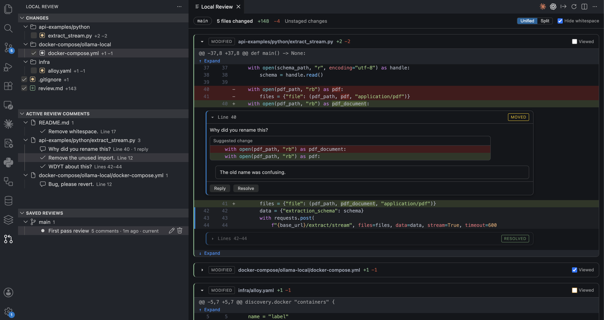

# Local Review

Review your local git changes like a pull request, without opening one. Then hand the review to a coding agent, or let the agent post its own.

> **Everything stays on your machine.** No remote, no PR, no account, no telemetry.

## What it does

- Renders your working-tree diff as a continuous, PR-style review inside VS Code (unified or side-by-side, syntax-highlighted).
- Lets you comment on any line or range, on added or removed lines, with reply, resolve, and code suggestions.
- Keeps comments anchored as code shifts. They drift with their lines, or go "outdated", never silently lost.
- Saves a review per branch automatically.
- Hands off to a coding agent two ways: a structured Markdown export, or a live MCP connection.

## Getting started

1. Install the extension (see [Install](#install)).
2. Make some local changes, then open **Local Review** from the activity bar. The diff opens in a full-width tab.
3. Hover a line and click **+** (or drag to select a range) to comment. Reply and resolve as you go.
4. Hand it to a coding agent:
   - **Export:** run **Export Review** for a Markdown work list (clipboard, file, or editor), then paste it into your agent.
   - **MCP (live):** run **Set up MCP**, connect your agent, and it reads the diff and posts comments straight into the review.

## Agent integration (MCP)

Local Review runs a standard, local MCP server (bound to `127.0.0.1`, token-guarded, off by default) that any MCP client can use. The handoff goes both ways: you comment and the agent actions it, and the agent can post its own comments, replies, and suggestions that show up in the panel attributed to "AI Agent", anchored like yours.

1. Run **Local Review: Set up MCP**. Pick a port and whether to start it on launch.
2. It writes `.local-review/mcp.json` with the URL, token, and ready-to-run connect commands (Claude Code, plus a generic `mcpServers` config for other clients).
3. Connect your client. Use **Start MCP Server** / **Stop MCP Server** to control it anytime.

Tools the agent gets: `get_diff`, `get_review`, `list_reviews`, `post_comment`, `reply`, `resolve`. It never writes to your files. It posts comments, and actions them by editing code itself.

## Features

- **Unified and side-by-side** diff, toggleable.
- **Syntax highlighting** with intra-line word highlighting (only the changed characters light up).
- **Expand context** at hunk boundaries to reveal surrounding lines.
- **Hide whitespace** changes.
- **Inline comments** on single lines or ranges, old or new side, with edit, delete, reply, resolve.
- **Suggestions:** propose replacement code in a comment, rendered as a before/after diff and captured in the export. Never written to disk.
- **Markdown comments**, rendered in the panel.
- **Line drift:** comments follow their lines, and go "outdated" instead of vanishing when they can't be matched.
- **Branch-tied reviews:** saved automatically per branch. Reviews for deleted or merged branches are archived, not lost, and can be moved to the current branch.
- **Structured Markdown export:** grouped by file, scoped to all, unresolved, or one file, at current or as-reviewed line positions.

## Diff sources

Pick what you review from **Select Diff Source**:

| Source                    | What it shows                          |
| ------------------------- | -------------------------------------- |
| **Uncommitted changes**   | everything not yet committed (default) |
| **Unstaged changes**      | not yet staged                         |
| **Staged changes**        | staged for commit                      |
| **Compare with a branch** | diff against another local branch      |

Switching source changes only what you see. Comments re-anchor against whatever is loaded, so staging a hunk or switching source never orphans one.

## Install

Install from the VS Code Marketplace: search **Local Review** in the Extensions view, or run `code --install-extension StefanPantic.local-review`.

Prefer a packaged `.vsix`? Download `local-review-<version>.vsix` from [Releases](https://github.com/stefanpantic/local-review-vscode-extension/releases), or build it with `pnpm run package` (see [CONTRIBUTING](CONTRIBUTING.md)). Then in VS Code open the **Extensions** view, use the `⋯` menu, and pick **Install from VSIX…**, or run `code --install-extension local-review-<version>.vsix`.

## Keybindings

| Action                       | Shortcut                      | Context             |
| ---------------------------- | ----------------------------- | ------------------- |
| Next / previous changed file | `Alt+↓` / `Alt+↑`             | in the review panel |
| Next / previous comment      | `Alt+Shift+↓` / `Alt+Shift+↑` | in the review panel |
| Rename review                | `F2`                          | in the Reviews view |

## Settings

| Setting                             | Default            | Description                                                    |
| ----------------------------------- | ------------------ | -------------------------------------------------------------- |
| `localReview.defaultSource`         | `worktree-vs-head` | Diff source when a review is first opened.                     |
| `localReview.defaultViewMode`       | `unified`          | Default rendering mode (`unified` or `split`).                 |
| `localReview.defaultHideWhitespace` | `false`            | Hide whitespace-only changes by default.                       |
| `localReview.includeUntracked`      | `true`             | Include untracked files (ignores `.gitignore`d files).         |
| `localReview.largeFileThreshold`    | `1000`             | Files with more changed lines than this start collapsed.       |
| `localReview.contextLines`          | `3`                | Lines of surrounding context captured for comments and export. |
| `localReview.mcp.autoStart`         | `false`            | Start the MCP server when VS Code launches.                    |
| `localReview.mcp.port`              | `0`                | MCP server port (`0` picks a free port and reuses it).         |
| `localReview.log`                   | `false`            | Write diagnostic logs to the "Local Review" output channel.    |

## Contributing

Development setup, the build and watch loop, and the release process are in [CONTRIBUTING.md](CONTRIBUTING.md). Bug reports and feature requests are welcome via the [issue templates](https://github.com/stefanpantic/local-review-vscode-extension/issues/new/choose).

## Credits

Icon by [edt.im](https://edt.im).

## License

[MIT](LICENSE) © Stefan Pantic
