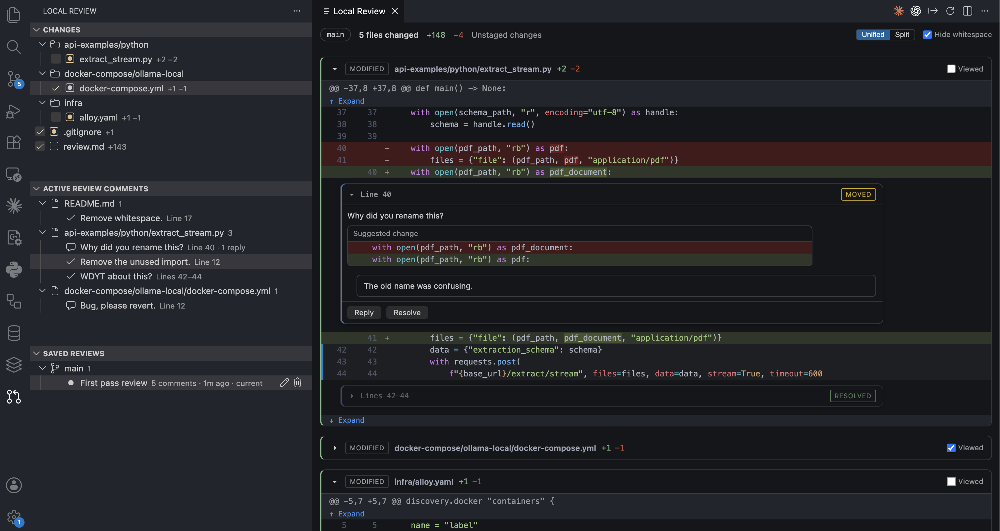

# ReviewMate

[](https://github.com/stefanpantic/local-review-vscode-extension/actions/workflows/ci.yml)
[](LICENSE)
[](https://www.conventionalcommits.org)
[](https://prettier.io)

A pull-request review surface inside VS Code, for three things: your own uncommitted changes, a real GitHub pull request, and a coding agent reviewing alongside you.

> **Local-first.** Reviewing your git diff happens entirely on your machine. The only network traffic is GitHub pull request review: fetching a PR when you open one, and posting your review when you press **Submit**. Nothing else leaves your box. No account. No telemetry.



## What it does

- **Reviews your working-tree diff** as a continuous, PR-style surface: unified or side-by-side, syntax-highlighted, with comments on any line or range.
- **Reviews a real GitHub pull request** in the same UI. The PR is fetched in place, with no checkout and no change to your working tree, and every existing review thread is imported. github.com and GitHub Enterprise.
- **Writes your review back.** Comment, reply, resolve, edit, and suggest, then post the lot as one GitHub review with **Comment**, **Approve**, or **Request changes**.
- **Lets a coding agent review with you** over a local MCP server. It reads the diff and posts its own comments, replies, and suggestions into the same review, attributed to "AI Agent".
- **Exports any review** as an agent-ready Markdown work list, for agents you have not wired up over MCP.
- **Keeps comments anchored** as code shifts. They follow their lines, or go "outdated". They are never silently lost.
- **Saves a review per branch** automatically, including one per pull request.

## Getting started

Install the extension (see [Install](#install)), then open **ReviewMate** from the activity bar. Pick whichever of these you came for.

**Review your own changes.** Your uncommitted diff opens in a full-width tab. Hover a line and click **+**, or drag to select a range, to comment. Reply and resolve as you go.

**Review a GitHub pull request.** If the repo's `origin` is a GitHub remote, a **Pull Requests** section lists the open PRs. Click one. Review it exactly like a local diff, then press **Submit review** to post everything back. See [Review a GitHub pull request](#review-a-github-pull-request).

**Bring in your coding agent.** Run **Set up MCP** and connect it, and the agent reviews alongside you in the same threads. Or run **Export Review** for a Markdown work list to paste in. See [Agent integration](#agent-integration-mcp).

## Review a GitHub pull request

When the current repo's `origin` is a GitHub remote, a **Pull Requests** section appears in the ReviewMate sidebar listing the open PRs. Click one to review it. You can also run **ReviewMate: Review Pull Request** (or pick it from **Select Diff Source**), which signs you in with VS Code's built-in GitHub sign-in the first time, lists the open PRs, and also accepts a PR URL or number. Either way it:

- fetches the PR head and base **in place** (into hidden refs under `refs/agentic-review/`), so your working tree, index, and current branch are never touched.
- renders `base...head` in the usual diff UI, with a header pill showing the source and target branches and a card with the PR title, state, and description.
- imports all review threads at their correct file, side, and line, including resolved and outdated ones, with suggestions.
- lists the PR as its own group in the **Reviews** sidebar, separate from your local branch reviews, and tracks "viewed" state per PR.

### Filter the list

Click the funnel in the **Pull Requests** title bar to open a filter box. It filters as you type and tells you how many PRs are left, with presets for the usual questions, a row per author, and a row per team a PR is waiting on:

| Filter                         | Shows                                                        |
| ------------------------------ | ------------------------------------------------------------ |
| `review-requested:@me`         | PRs waiting on you, asked of you **or of a team you are in** |
| `user-review-requested:@me`    | Only PRs where you were asked by name                        |
| `team-review-requested:<slug>` | PRs waiting on that team, whoever is in it                   |
| `author:@me`                   | PRs you opened                                               |
| `author:<login>`               | PRs by someone else                                          |
| `is:draft` / `is:ready`        | Drafts, or everything that is not a draft                    |
| any other text                 | Every word matched against the number, title, or author      |

These are GitHub's own search qualifiers, so they mean here what they mean there. Filters combine, so `author:octocat is:draft` means both. The section header always names what you are looking at, either **All open** or the filter and how much it leaves, like **Created by me · 2 of 14**. The funnel fills in while a filter is on, and clicking it reopens the box, where the first row clears the filter. The filter is remembered across restarts.

Filtering runs against the list already loaded, so it costs no network call. The one exception: when some PR in the list is waiting on a team, your team memberships are looked up once so `review-requested:@me` can match them. Repos that never request reviews from teams never make that call. If the lookup is unavailable, `review-requested:@me` still matches everything asked of you by name and the view says teams could not be checked, rather than quietly showing a short list.

`review-requested:<someone-else>` matches only what was asked of that person by name. Another person's team memberships are not knowable without asking GitHub about each one, so they are not assumed.

### Write your review back

Reviewing a PR adds a **pull request bar** across the top of the review, always visible as you scroll. Everything you can do to the PR is there, so nothing hides in the command palette:

| Control           | What it does                                                                                             |
| ----------------- | -------------------------------------------------------------------------------------------------------- |
| **Submit review** | Posts everything you have staged as one GitHub review. Always shown, disabled until something is staged. |
| **Sync**          | Pulls the latest comments and checks for new commits. Reads **Sync paused** if GitHub cannot be reached. |
| **Discard**       | Throws away everything staged and resets to what is on GitHub now. Shown only when something is staged.  |
| **N pending**     | How much is staged. Hover for the breakdown. **N new** appears when other people comment while you read. |

The same actions sit in the **Pull Requests** sidebar title bar, and as **ReviewMate:** commands.

Comment, reply, resolve, and edit or delete your own and your agent's comments. These changes stay on your machine until you submit. Submit asks for one event, **Comment**, **Approve**, or **Request changes**, then an optional summary. Your changes post as one GitHub review, pinned to the commit you reviewed. Submit is the only network write.

Approve and Request changes are unavailable on a pull request you opened yourself, and on a closed or merged one, because GitHub rejects them. Only Comment is offered there.

If a submit fails partway, retry it. Whatever already posted is not sent again.

A PR also polls GitHub while it is open, so other people's new, edited, and resolved comments appear on their own. Set the interval with `agenticReview.github.pollInterval`. Use `0` to turn polling off. **The poll only adds and updates. It never removes a comment.** Deletions made on GitHub appear when you press **Sync**, or reopen the PR. This is deliberate: a background refresh should not delete a thread you are in the middle of replying to.

New commits on the PR raise a **Load new commits** banner. Loading them changes which diff you are reviewing, so it stays a separate, deliberate action rather than something Sync does to you. Your review stays on the commit you loaded until then, and a review left open is restored with its diff and comments after a restart.

Other people's comments are read-only. You can edit or delete only your own and your agent's comments, and that stays true if your GitHub session lapses while you review. If you delete one of your comments on GitHub, it stays in your review and its thread is badged **deleted on GitHub**. Submit reposts it. Delete it to discard. If you edit a comment that someone also edited on GitHub, it is flagged **edited on both sides**. Your version is kept and wins on Submit, so edit it to merge the two, or discard your edit to take theirs.

For **GitHub Enterprise**, set `agenticReview.github.enterpriseUri` to your server, for example `https://github.your-company.com`. VS Code's `github-enterprise.uri` must point at the same host.

## Agent integration (MCP)

ReviewMate runs a standard, local MCP server (bound to `127.0.0.1`, token-guarded, off by default) that any MCP client can use. You comment and the agent acts on it. The agent can also post its own comments, replies, and suggestions. They show up in the panel attributed to "AI Agent", anchored like yours, and on a pull request they post to GitHub with the rest of your review, under your account. They keep the "AI Agent" label in your review afterwards, so you can still tell which comments it wrote.

1. Run **ReviewMate: Set up MCP**. Pick a port and whether to start it on launch.
2. It generates an mcp.json (URL, token, and ready-to-run connect commands: Claude Code, plus a generic `mcpServers` config for other clients) and opens it. Reopen it anytime with **Open MCP Config**. It lives in the extension's per-workspace storage, not in your repo.
3. Connect your client. Use **Start MCP Server** / **Stop MCP Server** to control it anytime.

Tools the agent gets: `get_diff`, `get_active_review`, `get_review`, `list_reviews`, `post_comment`, `reply`, `resolve`, `edit_comment`, `delete_comment`. On a pull request, `get_diff` hands over the request as well as its lines: number, title, state, base and head, the description, and the commits, all read locally. It can revise and withdraw comments under the same rule you get, measured against the same identity: on a pull request its own comments and yours, so someone else's is never touchable, and on a local review any comment, because the only authors there are you and it. It never writes to your files: it posts comments and makes the changes by editing code itself. The server is loopback-only and has no GitHub access of its own.

### Or export a work list

For an agent you have not connected, **Export Review** produces agent-ready Markdown: grouped by file, scoped to all comments, unresolved only, or a single file, at current or as-reviewed line positions, with ` ```suggestion ` blocks intact. Copy it, write it to a file, or open it in an editor.

## Features

- **Unified and side-by-side** diff, toggleable.
- **Syntax highlighting** with intra-line word highlighting (only the changed characters light up).
- **Expand context** at hunk boundaries to reveal surrounding lines.
- **Hide whitespace** changes.
- **Find in the diff** with Ctrl+F (Cmd+F on macOS). Only expanded files are searched, so use **Expand all files** in the summary bar to cover files you have marked viewed or that opened collapsed.
- **Inline comments** on single lines or ranges, old or new side, with edit, delete, reply, resolve.
- **Suggestions:** propose replacement code in a comment, rendered as a before/after diff. Posted to GitHub as an applicable suggestion, and included in the export. Never written to your files.
- **Markdown comments**, rendered in the panel.
- **Back to top** button once you have scrolled into a long diff.
- **Line drift:** comments follow their lines. When they can't be matched they go "outdated" and stay in the review.
- **Branch-tied reviews:** saved automatically per branch, and per pull request. Reviews for deleted or merged branches are archived and can be moved to the current branch.

## Diff sources

Pick what you review from **Select Diff Source**:

| Source                    | What it shows                          |
| ------------------------- | -------------------------------------- |
| **Uncommitted changes**   | everything not yet committed (default) |
| **Unstaged changes**      | not yet staged                         |
| **Staged changes**        | staged for commit                      |
| **Compare with a branch** | diff against another local branch      |
| **Pull request**          | a fetched GitHub PR (`base...head`)    |

Switching source changes only what you see. Comments re-anchor against whatever is loaded, so staging a hunk or switching source never orphans one.

## Install

Install from the VS Code Marketplace: search **ReviewMate** in the Extensions view, or run `code --install-extension StefanPantic.agentic-review`.

Prefer a packaged `.vsix`? Download `agentic-review-<version>.vsix` from [Releases](https://github.com/stefanpantic/local-review-vscode-extension/releases), or build it with `pnpm run package` (see [CONTRIBUTING](CONTRIBUTING.md)). Then in VS Code open the **Extensions** view, use the `⋯` menu, and pick **Install from VSIX…**, or run `code --install-extension agentic-review-<version>.vsix`.

## Keybindings

| Action                       | Shortcut                      | Context             |
| ---------------------------- | ----------------------------- | ------------------- |
| Next / previous changed file | `Alt+↓` / `Alt+↑`             | in the review panel |
| Next / previous comment      | `Alt+Shift+↓` / `Alt+Shift+↑` | in the review panel |
| Rename review                | `F2`                          | in the Reviews view |

## Settings

| Setting                               | Default            | Description                                                                 |
| ------------------------------------- | ------------------ | --------------------------------------------------------------------------- |
| `agenticReview.defaultSource`         | `worktree-vs-head` | Diff source when a review is first opened.                                  |
| `agenticReview.defaultViewMode`       | `unified`          | Default rendering mode (`unified` or `split`).                              |
| `agenticReview.defaultHideWhitespace` | `false`            | Hide whitespace-only changes by default.                                    |
| `agenticReview.defaultWrap`           | `false`            | Wrap long lines instead of scrolling horizontally.                          |
| `agenticReview.includeUntracked`      | `true`             | Include untracked files (ignores `.gitignore`d files).                      |
| `agenticReview.largeFileThreshold`    | `1000`             | Files with more changed lines than this start collapsed.                    |
| `agenticReview.github.enterpriseUri`  | `""`               | GitHub Enterprise Server base URL. Empty uses github.com.                   |
| `agenticReview.github.pollInterval`   | `60`               | Seconds between polls of an open PR for upstream changes. `0` turns it off. |
| `agenticReview.mcp.autoStart`         | `false`            | Start the MCP server when VS Code launches.                                 |
| `agenticReview.mcp.port`              | `0`                | MCP server port (`0` picks a free port and reuses it).                      |
| `agenticReview.log`                   | `false`            | Write diagnostic logs to the "ReviewMate" output channel.                   |

## Contributing

Development setup, the build and watch loop, and the release process are in [CONTRIBUTING.md](CONTRIBUTING.md). Bug reports and feature requests are welcome via the [issue templates](https://github.com/stefanpantic/local-review-vscode-extension/issues/new/choose).

## FAQ

### I work across several repositories. Do I register the MCP server for each one?

Each VS Code window runs its own MCP server, on its own port with its own token, for the repository open in that window. That is why the connect details are per workspace.

You do not keep one global list of servers. The `claude mcp add` command we generate uses Claude Code's default **local scope**, which is tied to the current project directory: run it once inside a repo and only that repo's Claude Code sees the server, with no name collision across repos. Cursor and VS Code's own MCP support have the same per-project scoping. The exception is clients with a single global config and no project scope (for example Claude Desktop), where you give each server a distinct name. In every case you only wire up the repositories you actually want the agent to review.

### Won't multiple open windows fight over the same port?

No. With the default `agenticReview.mcp.port` of `0`, each workspace is assigned a stable, unique port from a registry shared across all your VS Code windows, so two windows never land on the same one, and each keeps its port across restarts (its connect URL stays put, so you register it once). If a port is ever taken by another process, that window falls back to a free one and remembers it.

### Where does the connect file live?

In VS Code's per-workspace extension storage, not in your repository, so nothing is committed or gitignored. Open it anytime with the **Open MCP Config** command, or the button shown after **Set up MCP**.

### Does the agent's review get posted to GitHub?

Yes, if you submit it. Agent comments sit in the same pending set as yours and post under your account, so you own what goes out. The Submit confirmation tells you how many of the items are agent-authored before anything is sent.

## Credits

Icon by [edt.im](https://edt.im).

## License

[MIT](LICENSE) © Stefan Pantic
